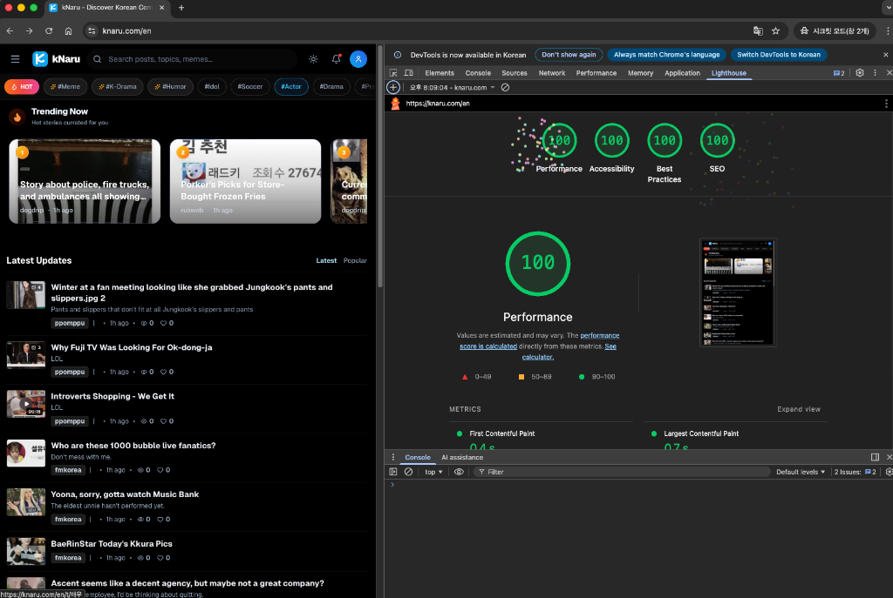

# Next.js Performance & SEO Configuration



`next.config.js`와 코드 패턴 모음. [knaru.com](https://knaru.com)에서 Lighthouse 100점 달성에 사용한 설정.

---

## Tech Stack

- **Next.js 16** (App Router)
- **React 19** (React Compiler 포함)
- **Vercel** 배포
- **Bun** 패키지 매니저

---

## next.config.js 설정

### 1. Inline CSS
CSS 파일 요청을 제거해서 FCP 개선.

```javascript
experimental: {
  inlineCss: true,
}
```

### 2. 캐시 헤더
정적 파일 1년 캐시.

```javascript
async headers() {
  return [
    {
      source: '/_next/static/:path*',
      headers: [
        { key: 'Cache-Control', value: 'public, max-age=31536000, immutable' },
      ],
    },
  ]
}
```

### 3. 패키지 최적화
무거운 라이브러리 트리쉐이킹.

```javascript
experimental: {
  optimizePackageImports: ['lucide-react', 'date-fns', 'react-hook-form'],
}
```

---

## 코드 패턴

### 폰트
CLS 방지용 `next/font` 설정.

```tsx
import { Inter } from 'next/font/google';

const inter = Inter({
  subsets: ['latin'],
  display: 'swap',
});
```

### 서드파티 스크립트
메인 스레드 차단 방지.

```tsx
<Script src="https://..." strategy="lazyOnload" />
```

### ISR
정적 페이지 + 백그라운드 갱신.

```tsx
export const revalidate = 60;

export default async function Post({ params }) {
  const data = await getPost(params.id);
  return <PostContent data={data} />;
}
```

---

## 참고

- 라이브 사이트: [knaru.com](https://knaru.com)
- PageSpeed Insights나 Chrome DevTools로 직접 측정 가능

---

MIT License
